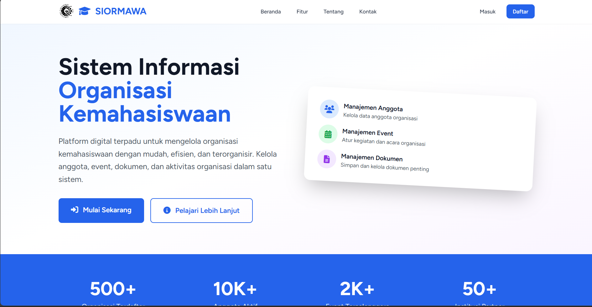

# SIORMAWA - Manajemen Organisasi Kemahasiswaan UNM

**Status:** Pengembangan (40%)

## Deskripsi

**SIORMAWA** adalah aplikasi manajemen organisasi kemahasiswaan yang bertujuan untuk memudahkan pengelolaan data, aktivitas, dan administrasi organisasi di lingkungan kampus. Proyek ini masih dalam tahap pengembangan awal dan saat ini telah mencapai sekitar 40% dari target fitur utama.

## Fitur Utama (Rencana)

- Manajemen data anggota organisasi
- Pengelolaan agenda dan kegiatan organisasi
- Dokumentasi dan arsip surat-menyurat
- Laporan dan statistik aktivitas organisasi

## Status Pengembangan

Aplikasi masih dalam tahap pengembangan awal. Fitur-fitur utama sedang dalam proses implementasi dan akan terus diperbarui.

```markdown

```
## Lisensi

Aplikasi ini direncanakan akan menggunakan lisensi open source. Detail lisensi akan diumumkan setelah pengembangan mencapai tahap stabil.

---

**Kontak:**  
Untuk pertanyaan atau saran, silakan hubungi pengelola proyek melalui _issue_ di repository ini.

